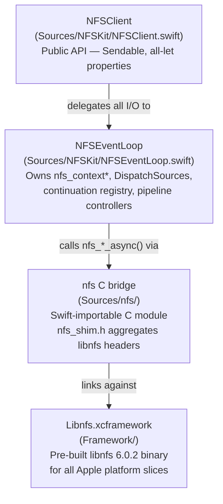
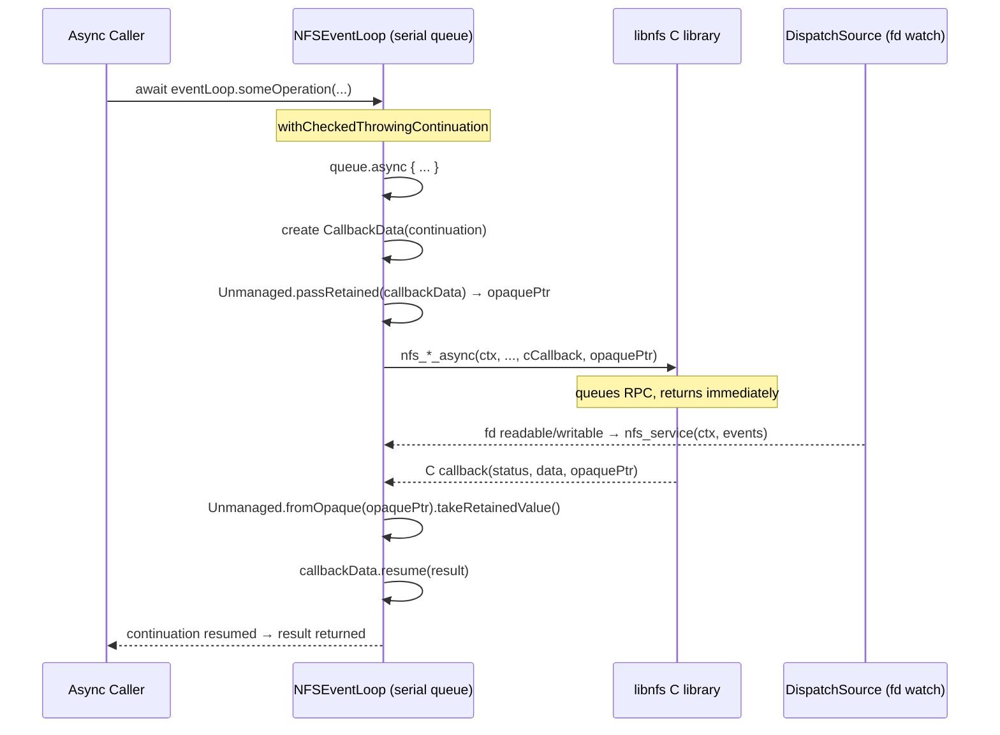
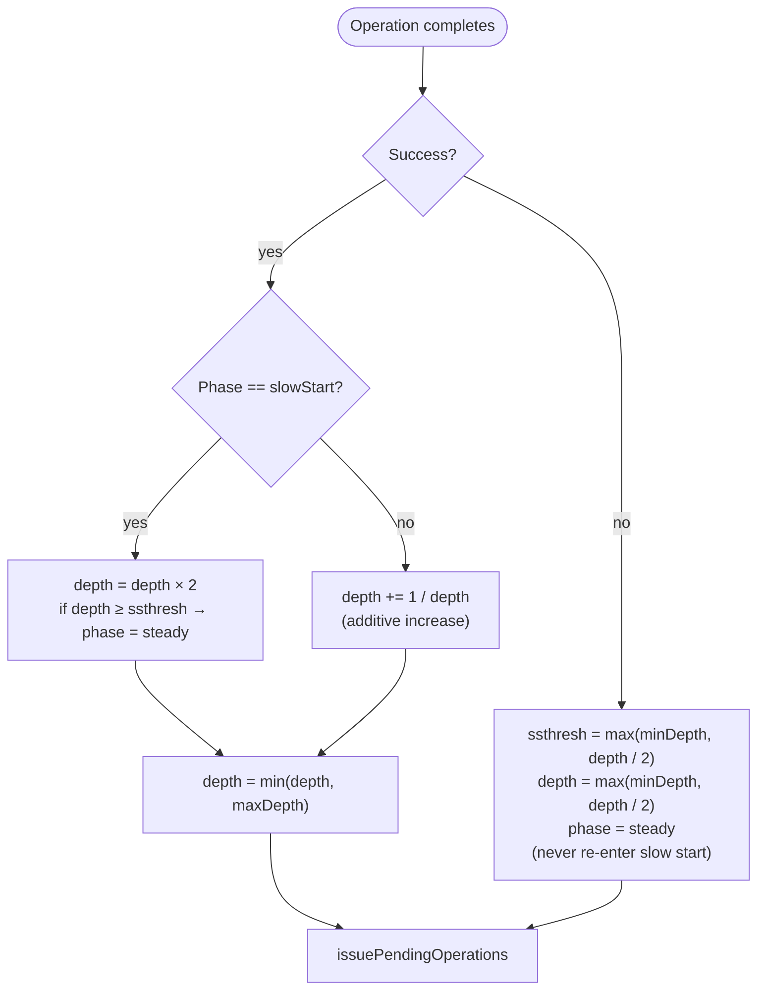
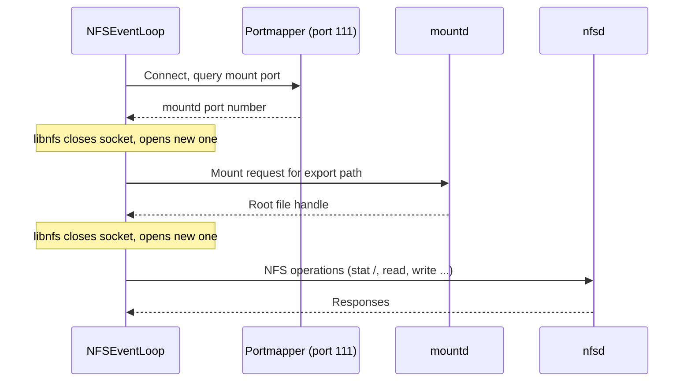
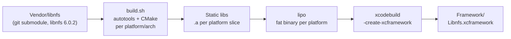

# NFSKit Architecture

NFSKit is a Swift wrapper around [libnfs](https://github.com/sahlberg/libnfs) that provides
async/await NFS client access for Apple platforms. This document describes the internal
architecture for contributors.

---

## Table of Contents

1. [Layer Stack](#layer-stack)
2. [Event Loop](#event-loop)
3. [Adaptive Pipeline](#adaptive-pipeline)
4. [Connection Lifecycle](#connection-lifecycle)
5. [C Bridge Module](#c-bridge-module)
6. [Memory Management](#memory-management)
7. [Thread Safety Model](#thread-safety-model)

---

## Layer Stack

NFSKit is composed of four layers. Each layer has a single responsibility and communicates
only with the layer directly beneath it.



**NFSClient** is the only public type. It holds an immutable reference to an `NFSEventLoop`
and forwards every operation to it. `NFSClient` itself is `Sendable` because all its stored
properties are `let`.

**NFSEventLoop** is the execution core. It owns the `nfs_context*`, the file-descriptor
DispatchSources, the continuation registry, and the two pipeline controllers. All mutable
state is confined to its serial `DispatchQueue`.

**nfs C bridge** (`Sources/nfs/`) is a Swift-importable module that aggregates the libnfs
public and private headers. The `nfs.c` file is an empty marker; the real content is in
`include/`.

**Libnfs.xcframework** is a pre-built binary produced from the `Vendor/libnfs` submodule by
`build.sh` + `xcframework.sh`. It is checked into `Framework/` so consumers do not need
Homebrew or autotools.

---

## Event Loop

NFSEventLoop drives libnfs's async API using GCD DispatchSources rather than Swift
structured concurrency. This is intentional: libnfs exposes a C-level fd-readiness model
that maps naturally onto DispatchSources, and doing so keeps all libnfs state mutations
on a single serial queue without bridging overhead.

### Async call → callback → continuation flow



**Key implementation details:**

- `CallbackData` is a heap-allocated Swift object that holds the `CheckedContinuation`,
  the operation ID, and a `hasResumed` flag that prevents double-resume during shutdown.
- The opaque pointer passed to libnfs is produced by `Unmanaged.passRetained()`, which
  increments the ARC retain count. The callback recovers the object with
  `Unmanaged.fromOpaque(_:).takeRetainedValue()`, which decrements it — giving the callback
  sole ownership of the object.
- `nextContinuationID` (a `UInt64` counter) uniquely identifies each in-flight operation.
  The `activeContinuations` dictionary maps ID → `CallbackData` so the event loop can
  cancel or time out specific operations.
- DispatchSources are created with `DispatchSource.makeReadSource` / `makeWriteSource`
  for the file descriptor that `nfs_get_fd()` returns. They are unconditionally recreated
  after each `nfs_service` call if the fd or its inode has changed (see
  [Connection Lifecycle](#connection-lifecycle)).

---

## Adaptive Pipeline

Rather than issuing one RPC at a time and waiting for the response, NFSEventLoop issues
multiple concurrent RPCs up to a configured depth. The depth is adapted dynamically using
TCP-style AIMD (Additive Increase / Multiplicative Decrease) congestion control, implemented
in `PipelineController`.

### Two independent controllers

| Controller | Operations |
|------------|-----------|
| Bulk | `read`, `pread`, `write`, `pwrite` |
| Metadata | `stat`, `mkdir`, `rmdir`, `open`, `close`, `rename`, `truncate`, `readlink`, `statvfs`, `opendir`, `mount`, `umount` |

The two pipelines adapt independently, so a burst of metadata operations cannot consume
slots reserved for bulk transfers and vice versa.

### AIMD algorithm



**Parameters (defaults):**

| Parameter | Default | Description |
|-----------|---------|-------------|
| `depth` | 2.0 | Initial fractional pipeline depth |
| `ssthresh` | 16.0 | Slow-start threshold |
| `minDepth` | 1 | Floor on effective depth |
| `maxDepth` | 32 | Ceiling on effective depth |

`effectiveDepth` is `Int(depth)` clamped to `[minDepth, maxDepth]`. The fractional
representation allows smooth AIMD arithmetic without integer rounding artifacts.

### Pending operations queue

Operations that arrive when the in-flight count for their category is at `effectiveDepth`
are placed in `pendingOperations`. After each operation completes, `issuePendingOperations()`
drains the queue up to the current effective depth.

---

## Connection Lifecycle

Mounting an NFS share is a multi-step RPC handshake: the client contacts the portmapper,
is redirected to mountd, and is then redirected to the NFS daemon. libnfs handles this
internally, but it closes and reopens its socket at each step.

### Mount handshake



### fd reuse and DispatchSource recreation

macOS kqueue silently drops registrations when an fd is closed. When libnfs reopens its
socket it may receive the same fd number (macOS reuses the lowest available fd). A
DispatchSource watching the old fd/inode combination would then either fire on the wrong
socket or never fire.

NFSEventLoop defends against this by:

1. Recording the fd and its inode (`socketIno()` calls `fstat()` on the fd) after each
   `nfs_service` call.
2. Comparing the current fd and inode against the recorded values before the next event.
3. Unconditionally cancelling and recreating the DispatchSource if either value changed.

### Export listing (getexports)

`getexports` uses `mount_getexports_async`, which requires a **separate** `rpc_context`
created with `rpc_init_context()`. Using the main NFS context's RPC handle would interleave
portmapper traffic with the live NFS connection and corrupt its state.

The separate `rpc_context` gets its own pair of DispatchSources and is destroyed after the
export list is returned.

---

## C Bridge Module

### Module structure

```
Sources/nfs/
├── nfs.c                    # Empty marker file (required by Swift Package Manager)
└── include/
    ├── module.modulemap     # Declares the 'nfs' module
    ├── nfs_shim.h           # Aggregates all libnfs headers (see below)
    ├── config.h             # libnfs build-time configuration flags
    └── libnfs-private.h     # Private libnfs types needed by NFSEventLoop
```

`nfs_shim.h` includes every libnfs public and raw header:

```
libnfs.h             — high-level NFS API (nfs_context*, nfs_mount, nfs_open, ...)
libnfs-raw.h         — raw RPC layer (rpc_context*, rpc_get_fd, rpc_service, ...)
libnfs-raw-mount.h   — mount protocol (mount_getexports_async, ...)
libnfs-raw-nfs.h     — NFS protocol raw types
libnfs-raw-portmap.h — portmapper protocol
libnfs-zdr.h         — ZDR (XDR variant) serialisation
... (plus nfs4, nlm, nsm, rquota)
```

The `cSettings` block in `Package.swift` defines the preprocessor flags required by these
headers: `HAVE_CONFIG_H`, `HAVE_SOCKADDR_LEN`, `_FILE_OFFSET_BITS=64`, and the
`NFSCLIENT` define.

### XCFramework build pipeline



`build.sh` accepts `-p` (platform list) and `-a` (arch list) flags. `xcframework.sh` then
combines the per-platform fat libraries with their matching headers into a single
`.xcframework` bundle. The resulting framework is checked in so consumers need no build
toolchain beyond Xcode.

---

## Memory Management

### CallbackData and Unmanaged pointers

Every async operation creates one `CallbackData` object. Its lifetime spans the gap between
the `nfs_*_async` call and the C callback invocation.

```
nfs_*_async called
    → Unmanaged.passRetained(callbackData)   # ARC +1, gives C a raw pointer
    → libnfs holds opaquePtr

C callback fires
    → Unmanaged.fromOpaque(opaquePtr)
         .takeRetainedValue()                # ARC -1, Swift reclaims ownership
    → callbackData.resume(result)
    → callbackData released by ARC
```

The `hasResumed` flag in `CallbackData` is a single-assignment guard. If the event loop
is torn down while an operation is in flight, the shutdown path calls `resume(.failure)`
on all active continuations; the flag ensures the C callback — if it fires late — does
not resume the already-completed continuation a second time, which would crash.

### ReadBuffer and zero-copy reads

`ReadBuffer` is an ARC-managed wrapper around a single `UnsafeMutableRawPointer` allocation.

```
ReadBuffer(byteCount: N)       # allocates N bytes; isOwned = true

  — on success —
buffer.disown()                # isOwned = false
Data(bytesNoCopy: buffer.pointer,
     count: N,
     deallocator: .custom { ptr, _ in ptr.deallocate() })
                               # Data now owns the allocation; ARC releases ReadBuffer
                               # without freeing (isOwned == false)

  — on error —
// ReadBuffer goes out of scope; deinit runs; isOwned == true → pointer.deallocate()
```

This avoids copying file data: the pre-allocated buffer path in `NFSClient.contents(atPath:)`
writes `pread` results directly into the buffer, then transfers ownership to `Data` with
`bytesNoCopy`. The `Data` value deallocates the memory when the last reference is released.

For files larger than 64 MB the legacy chunked read path is used to bound peak RSS; those
reads produce a `Data` value assembled from 1 MB chunks via `Data.append`.

### File handle registry

`NFSFileHandle` is a public, `Sendable` token. The actual `nfsfh*` pointer lives in
`NFSEventLoop.handleRegistry`, keyed by a `UInt64` handle ID. This keeps C pointers
confined to the serial queue.

```
openFile(path)
    → nfs_open_async succeeds
    → handleRegistry[newID] = nfsfhPointer   (on serial queue)
    → returns newID to caller

NFSFileHandle(handleID: newID, eventLoop: loop)   # Sendable, no raw pointer

NFSFileHandle.deinit
    → loop.closeFileFireAndForget(handleID: id)   # fire-and-forget queue.async
    → handleRegistry[id] = nil  (on serial queue)
    → nfs_close_async(nfsfhPointer)
```

When `nfs_destroy_context` is called during shutdown it releases any remaining
`nfsfh*` handles that were not explicitly closed, so leaked handles do not cause
server-side resource exhaustion.

---

## Thread Safety Model

### Type annotations

| Type | Annotation | Reason |
|------|-----------|--------|
| `NFSClient` | `Sendable` | All stored properties are `let` |
| `NFSEventLoop` | `@unchecked Sendable` | Mutable state confined to serial `DispatchQueue` |
| `NFSFileHandle` | `Sendable` | Immutable `handleID` + immutable `eventLoop` reference |
| `ReadBuffer` | `@unchecked Sendable` | Single-writer: `isOwned` mutated only before sharing |
| `PipelineController` | `Sendable` | Value type; mutated only on the serial queue |
| `NFSSecurity` | `Sendable` | Enum (value type) |
| `NFSStats` | `Sendable` | Struct of value types |
| `NFSDirectory` | (none) | Legacy, not thread-safe, internal use only |

### Queue confinement rules

All mutations to the following state must occur on `NFSEventLoop.queue` (a serial
`DispatchQueue`):

- `nfs_context*` and all libnfs API calls
- `activeContinuations` dictionary
- `pendingOperations` array
- `handleRegistry` dictionary
- `bulkPipeline` and `metadataPipeline` (`PipelineController` instances)
- DispatchSource references (`readSource`, `writeSource`)
- Current fd and inode tracking variables

### Crossing the isolation boundary

Public `async` methods on `NFSClient` and `NFSFileHandle` call `await eventLoop.someMethod()`
where `someMethod` is an `async func` on `NFSEventLoop`. Inside that method a
`withCheckedThrowingContinuation` suspends the Swift task; a `queue.async` block then
runs on the serial queue, performs the libnfs call, and the C callback eventually resumes
the continuation. The result crosses back to the caller's task via the continuation
mechanism — no data races occur because the result value is a Swift value type (`Data`,
`Int`, etc.) or a `Sendable` token (`NFSFileHandle`).

All public closures accepted by `NFSClient` (e.g., progress callbacks) are typed
`@Sendable` to enforce that captured state is safe to use from any isolation context.
